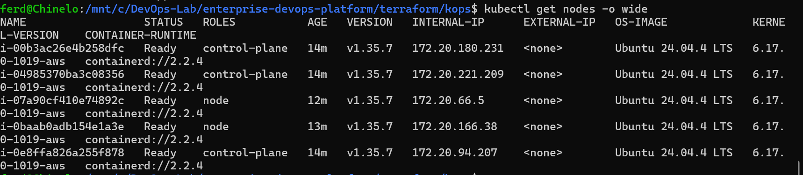
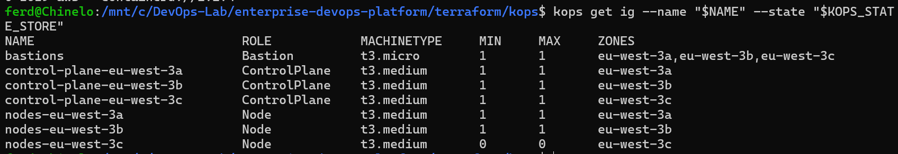
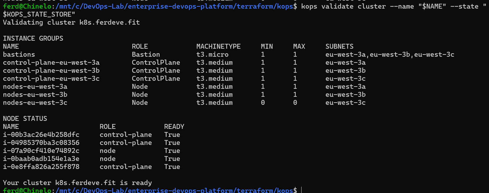

# Kubernetes Cluster with KOps

## 1. Purpose

Kubernetes provides the container orchestration layer for the Enterprise DevOps Platform.

The cluster is provisioned on AWS using **KOps (Kubernetes Operations)**.

Kubernetes is responsible for running and managing:

* Pet Adoption application workloads
* NGINX Ingress Controller
* cert-manager
* ArgoCD
* Prometheus
* Grafana
* Alertmanager
* kube-state-metrics
* node-exporter

KOps was selected because it exposes more of the underlying Kubernetes and AWS infrastructure than a fully managed Kubernetes service, making it valuable for demonstrating cluster administration, networking, scaling, DNS, and lifecycle-management knowledge.

---

## 2. Why KOps?

A managed service such as Amazon EKS reduces the amount of control-plane infrastructure an engineer must manage.

For this project, KOps provides greater visibility into how a Kubernetes cluster operates on AWS.

KOps manages resources including:

* Kubernetes control-plane nodes
* worker nodes
* Auto Scaling Groups
* IAM roles
* security groups
* networking configuration
* DNS records
* instance groups
* cluster state

This makes the platform useful for learning and demonstrating Kubernetes infrastructure rather than only consuming Kubernetes as a managed AWS service.

The trade-off is that KOps introduces additional operational responsibility.

---

## 3. Cluster Architecture

At a high level:

```text
                     AWS
                      |
             Kubernetes Cluster
                      |
        +-------------+-------------+
        |                           |
        v                           v
 Control Plane                 Worker Nodes
        |                           |
        |                    +------+------+
        |                    |             |
        v                    v             v
 API Server              App Pods     Platform Pods
 Scheduler
 Controller Manager
 etcd
```

The control plane manages the desired state of the cluster.

Worker nodes provide the compute capacity where application and platform Pods run.

---

## 4. Control Plane

The Kubernetes control plane contains the components responsible for managing the cluster.

Major components include:

### kube-apiserver

The API server is the main entry point into Kubernetes.

Commands such as:

```bash
kubectl get pods
kubectl apply -f deployment.yaml
kubectl scale deployment
```

communicate with the Kubernetes API server.

The API server validates and processes requests before cluster state is changed.

### etcd

etcd stores Kubernetes cluster state.

Examples include:

* Deployments
* Services
* Secrets
* ConfigMaps
* namespaces
* desired replica counts

If etcd data is lost without a usable backup or recovery mechanism, the control plane loses its authoritative cluster-state database.

### kube-scheduler

The scheduler determines which worker node should run a newly created Pod.

It considers factors such as:

* available resources
* scheduling constraints
* node selectors
* taints and tolerations
* affinity rules

### kube-controller-manager

The controller manager runs control loops that continuously compare desired state with actual state.

For example:

```text
Desired replicas = 2
Actual replicas  = 1
```

The relevant controller works to bring the cluster back to:

```text
Actual replicas = 2
```

This reconciliation behaviour is one of the fundamental concepts behind Kubernetes.

---

## 5. Worker Nodes

Worker nodes run the actual workloads.

Examples include:

```text
Pet Adoption Pods
ArgoCD
Prometheus
Grafana
Alertmanager
NGINX Ingress
cert-manager
```

Important worker-node components include:

### kubelet

The kubelet runs on each node and communicates with the Kubernetes API server.

It ensures that Pods assigned to that node are actually running.

### Container Runtime

The container runtime executes the containers defined inside Pods.

### kube-proxy / Cluster Networking

Kubernetes networking components help implement Service connectivity and network traffic routing within the cluster.

---

## 6. KOps Instance Groups

KOps uses **InstanceGroups** to describe groups of EC2 instances participating in the cluster.

Instance groups define characteristics such as:

* machine type
* minimum instance count
* maximum instance count
* AWS availability zones
* node role

The project keeps the KOps configuration under:

```text
terraform/kops/config/
```

including:

```text
cluster.yaml
instance-groups.yaml
```

This keeps important cluster configuration version controlled.

---

## 7. Kubernetes Request Flow

When an engineer runs:

```bash
kubectl get pods
```

the request does not communicate directly with a worker node.

The simplified request path is:

```text
kubectl
   |
   v
kubeconfig
   |
   v
Cluster DNS / API Endpoint
   |
   v
kube-apiserver
   |
   +--> Authentication
   |
   +--> Authorization
   |
   v
Kubernetes State
   |
   v
API Response
   |
   v
kubectl
```

For a change request such as:

```bash
kubectl apply -f deployment.yaml
```

Kubernetes records the desired state and its controllers work to make the actual cluster match it.

---

## 8. Pod Deployment Flow

When a Deployment is created, the process can be simplified as:

```text
Deployment
    |
    v
ReplicaSet
    |
    v
Pod requested
    |
    v
Scheduler
    |
    v
Worker Node selected
    |
    v
kubelet
    |
    v
Container Runtime
    |
    v
Container starts
```

The Deployment does not directly create and manage individual containers.

Kubernetes uses several layers of controllers to maintain the desired state.

---

## 9. Namespaces and Environment Separation

The project uses a single Kubernetes cluster with separate namespaces for the three application environments.

```text
pet-adoption-dev
pet-adoption-staging
pet-adoption-prod
```

This provides logical separation between environments.

The advantages include:

* lower infrastructure cost
* simpler portfolio operation
* centralized monitoring
* reuse of platform services
* easier environment comparison

The trade-off is that the environments still share the same underlying cluster.

For a larger production system with stronger isolation requirements, separate clusters or AWS accounts could be considered.

---

## 10. Application Deployment

Application manifests are managed using Kustomize.

The common configuration lives in:

```text
gitops/pet-adoption/base/
```

Environment-specific configuration lives in:

```text
gitops/pet-adoption/overlays/dev/
gitops/pet-adoption/overlays/staging/
gitops/pet-adoption/overlays/prod/
```

This avoids copying the entire Kubernetes configuration for every environment.

Instead, the base defines the common workload and each overlay modifies only what differs.

Examples include:

* namespace
* replicas
* hostname
* container image tag

---

## 11. Replica Strategy

The current environment configuration uses:

```text
Development: 1 replica
Staging:     1 replica
Production:  2 replicas
```

Development and Staging minimize resource usage.

Production uses multiple replicas to demonstrate higher application availability.

If one production application Pod fails, Kubernetes can recreate it while another replica can continue serving traffic, subject to node and infrastructure availability.

---

## 12. External Traffic Flow

Application traffic enters the Kubernetes environment through the NGINX Ingress Controller.

The flow is:

```text
Internet User
     |
     v
Route 53
     |
     v
AWS Load Balancer
     |
     v
NGINX Ingress Controller
     |
     v
Environment Ingress
     |
     v
Kubernetes Service
     |
     v
Pet Adoption Pod
```

The Kubernetes Service provides a stable internal endpoint for the application Pods.

The Ingress defines hostname-based routing.

---

## 13. Environment Hostnames

The environments use separate DNS names:

```text
Development
dev.petadoption.ferdeve.fit

Staging
staging.petadoption.ferdeve.fit

Production
petadoption.ferdeve.fit
```

This allows each environment to be accessed and tested independently.

---

## 14. TLS

cert-manager manages TLS certificates inside Kubernetes.

Let's Encrypt acts as the certificate authority.

The simplified process is:

```text
Ingress requests TLS
       |
       v
cert-manager
       |
       v
Let's Encrypt
       |
       v
Domain validation
       |
       v
Certificate issued
       |
       v
Kubernetes TLS Secret
       |
       v
NGINX serves HTTPS
```

This removes the need to manually create and renew certificates.

---

## 15. ArgoCD and Kubernetes

ArgoCD runs inside the Kubernetes cluster and manages application deployment through GitOps.

ArgoCD continuously compares:

```text
Desired state in Git
        vs
Actual state in Kubernetes
```

When they differ, ArgoCD reports the application as:

```text
OutOfSync
```

For environments configured with automated synchronization, ArgoCD reconciles the cluster automatically.

This is another example of the desired-state reconciliation model used throughout Kubernetes.

---

## 16. Monitoring the Cluster

Prometheus monitors the Kubernetes environment.

Metrics come from several sources.

### kube-state-metrics

Provides information about Kubernetes objects such as:

* Deployment status
* replica availability
* Pod status
* node status

### node-exporter

Provides operating-system and node-level metrics such as:

* CPU
* memory
* filesystem
* network activity

### Kubernetes Components

Prometheus also discovers and monitors Kubernetes-related targets where available.

Grafana visualizes the collected metrics.

Alertmanager handles notifications generated from Prometheus alerts.

---

## 17. Failure Scenario: Application Pod

If an application Pod crashes:

```text
Pod fails
   |
   v
Kubernetes detects failure
   |
   v
Deployment/ReplicaSet controller reconciles state
   |
   v
Replacement Pod created
   |
   v
Scheduler selects node
   |
   v
Application restored
```

This demonstrates Kubernetes self-healing.

---

## 18. Failure Scenario: Worker Node

If a worker node becomes unavailable, workloads on that node may become unavailable temporarily.

Kubernetes can schedule replacement Pods onto healthy nodes when sufficient cluster capacity exists.

The effectiveness of this recovery depends on:

* available worker nodes
* replica count
* scheduling rules
* storage dependencies
* infrastructure capacity

Running multiple replicas across appropriate nodes improves resilience.

---

## 19. Failure Scenario: Bad Container Image

Kubernetes cannot fix a fundamentally broken application image.

For example, if a Deployment references an image that does not exist:

```text
Deployment
    |
    v
Pod created
    |
    v
Image pull attempted
    |
    X
ImagePullBackOff
```

The monitoring stack can detect the resulting unhealthy workload and generate alerts.

The CI/CD design reduces this risk by validating the application before promotion and by promoting the same immutable image through Dev, Staging, and Production.

---

## 20. Cluster Lifecycle Automation

The project contains scripts for KOps operations including:

```text
create-cluster.sh
update-cluster.sh
rolling-update.sh
export-kubeconfig.sh
validate-cluster.sh
delete-cluster.sh
verify-cleanup.sh
```

These scripts make cluster operations repeatable and reduce dependence on manually remembering long command sequences.

---

## 21. Cluster Validation

After cluster creation, validation is important before platform components are installed.

Checks include:

* Kubernetes API accessibility
* control-plane health
* worker-node readiness
* DNS functionality
* node registration
* cluster validation through KOps
* kubectl connectivity

Platform installation should not continue if the Kubernetes foundation itself is unhealthy.

---

## 22. KOps Trade-offs

KOps provides significant control and learning value, but that control has a cost.

### Advantages

* deeper visibility into Kubernetes infrastructure
* control over cluster topology
* AWS integration
* infrastructure transparency
* useful Kubernetes administration experience
* flexible cluster configuration

### Disadvantages

* more infrastructure to manage
* more operational responsibility
* control-plane management responsibility
* more complex upgrades
* potentially higher operational overhead than managed Kubernetes

For this portfolio, those disadvantages are acceptable because understanding the underlying Kubernetes infrastructure is part of the project's objective.

---

## 23. KOps vs EKS

EKS would be a strong option for a real AWS production environment where reducing control-plane operational burden is a priority.

KOps was intentionally used here because the project focuses on demonstrating infrastructure and Kubernetes knowledge.

The decision therefore was not:

```text
KOps is always better than EKS
```

It was:

```text
KOps better serves the learning and demonstration objectives
of this particular platform.
```

This distinction is important because technology selection should be based on requirements rather than loyalty to a particular tool.

---

## 24. Kubernetes Architecture Summary

The Kubernetes layer sits between AWS infrastructure and the higher-level DevOps platform services.

```text
AWS Infrastructure
       |
       v
KOps
       |
       v
Kubernetes Cluster
       |
       +---------------------------+
       |                           |
       v                           v
Platform Services           Application Workloads
       |                           |
       +-------------+-------------+
                     |
                     v
               NGINX Ingress
                     |
                     v
                  Users
```

KOps creates and manages the Kubernetes foundation.

Kubernetes provides scheduling, service discovery, self-healing, workload orchestration, and environment isolation.

ArgoCD controls application desired state.

NGINX provides ingress routing.

cert-manager provides TLS automation.

Prometheus, Grafana, and Alertmanager provide operational visibility.

Together these components form the runtime foundation of the Enterprise DevOps Platform.


---

## Live Deployment Evidence

A complete live deployment of the KOps cluster was performed and validated on AWS.

The deployment produced a highly available Kubernetes control plane across three Availability Zones, with two active worker nodes and a dedicated bastion InstanceGroup.

### Kubernetes Nodes



The cluster reached a healthy state with three control-plane nodes and two worker nodes reporting `Ready`.

### KOps Instance Groups



The InstanceGroup configuration confirms:

- one bastion group
- three control-plane groups across `eu-west-3a`, `eu-west-3b`, and `eu-west-3c`
- active worker groups in `eu-west-3a` and `eu-west-3b`
- a third worker group in `eu-west-3c` configured with zero desired capacity

### Cluster Validation



The cluster successfully passed:

```bash
kops validate cluster \
  --name k8s.ferdeve.fit \
  --state s3://enterprise-devops-platform-kops-state-740994137090